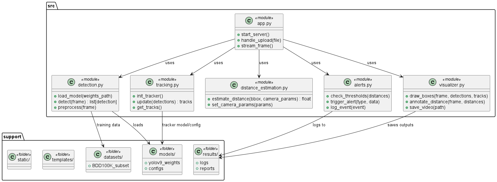
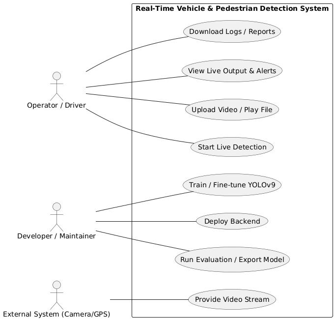

# 🚗 Real-Time Vehicle and Pedestrian Detection

### Minor Project – DSP5101

**Mentors:**  
Dr. Poonam Saini  
Dr. Kanu Goel  

**Team Members:**  
| Name | SID | Contribution |
|------|------|--------------|
| Bhavay Wadhwa | 23106016 | Model testing, data preprocessing |
| Rupesh Sharma | 23106020 | Backend integration, dataset handling |
| Guntaas Kapoor | 23106026 | Project architecture, documentation |
| Harjapan Singh Bhatia | 23106002 | YOLO fine-tuning, distance estimation module |

---

## 📘 Project Overview

The **Real-Time Vehicle and Pedestrian Detection** system is designed to enhance **road safety** by detecting vehicles and pedestrians in real-time using advanced computer vision techniques. The system provides **accurate localization**, **distance estimation**, and **live alerts**, making it suitable for **in-vehicle** and **roadside deployment** scenarios.

This project contributes to intelligent transportation systems (ITS) and autonomous driving research by providing a **lightweight, deep learning-based detection pipeline** capable of operating on edge devices.

---

## 🎯 Objectives

- Detect pedestrians and vehicles in **real time** from live camera feeds.  
- Estimate distances to detected objects using the **monocular pinhole camera model**.  
- Provide **warnings/alerts** based on proximity thresholds.  
- Maintain **lightweight deployment** suitable for embedded or low-power devices.  

---

## ⚙️ Tech Stack

- **Programming Language:** Python  
- **Deep Learning Framework:** PyTorch  
- **Model Architecture:** YOLOv9 (Ultralytics)  
- **Computer Vision Library:** OpenCV  
- **Tracking Algorithm:** DeepSORT  
- **Web Framework:** Flask  
- **Dataset:** BDD100K / BDD10K (Berkeley DeepDrive)  
- **Visualization:** Matplotlib, OpenCV  
- **Deployment:** Edge/Local System (real-time camera input)

---

## 🧠 System Workflow

1. **Input Feed:** Real-time video or dashcam stream.  
2. **Detection:** YOLOv9 model detects objects (person, car, bus, truck, bike, etc.).  
3. **Tracking:** DeepSORT maintains consistent identities across frames.  
4. **Distance Estimation:** Monocular pinhole model estimates object distance using bounding box width and camera parameters.  
5. **Alerts:** Distance-based thresholds generate warnings (for collision prevention).  
6. **Logging:** Events and detections are logged for later analysis.

---

## 🧩 Implementation Details

- **YOLOv9 Fine-tuning:**  
  The model was fine-tuned using the **BDD10K dataset**, improving domain adaptation for road and urban scenes.  

- **Distance Estimation:**  
  Uses the formula:  
  ```
  Distance = (Known Width * Focal Length) / Perceived Width
  ```
  This allows real-time distance approximation from single-camera input.  

- **Tracking:**  
  The DeepSORT algorithm provides temporal stability and consistent identification across video frames.  

---

## 📂 Repository Structure

```
SE-Pedestrian-and-Vehicle-Detection-RT/
│
├── datasets/                # Training/validation datasets (BDD100K subset)
├── models/                  # YOLOv9 model weights and configurations
├── notebooks/               # Experimentation and training notebooks
├── src/
│   ├── detection.py         # YOLOv9 object detection
│   ├── tracking.py          # DeepSORT tracking module
│   ├── distance_estimation.py # Pinhole distance estimation algorithm
│   ├── alerts.py            # Warning and alert management
│   └── app.py               # Flask backend for live video and API
│
├── static/                  # Frontend assets (CSS, JS, icons)
├── templates/               # Flask templates for UI
├── requirements.txt         # Dependencies
├── README.md                # Project documentation (this file)
└── results/                 # Output logs, performance reports, etc.
```

---

## 🧾 References

1. [Redmon et al., “You Only Look Once: Unified, Real-Time Object Detection”, CVPR 2016](https://www.cv-foundation.org/openaccess/content_cvpr_2016/papers/Redmon_You_Only_Look_CVPR_2016_paper.pdf)  
2. [Ultralytics YOLOv9 Documentation](https://docs.ultralytics.com/models/yolov9/)  
3. [BDD100K Dataset Paper (CVPR 2018)](https://arxiv.org/abs/1805.04687)  
4. [DeepSORT: Simple Online and Realtime Tracking](https://arxiv.org/abs/1703.07402)  
5. [OpenCV Documentation](https://docs.opencv.org/)  

---

## 🚀 Future Work

- Integrate GPS data for geo-tagged alerts.  
- Enhance detection for low-light and adverse weather.  
- Implement mobile app integration for real-time driver assistance.  
- Explore stereo or LiDAR-based distance refinement.

---

## 🏁 Conclusion

This project successfully demonstrates an **AI-powered real-time detection and alert system** for vehicles and pedestrians. It lays the groundwork for future **smart transportation and safety systems**, combining **deep learning**, **computer vision**, and **edge computing** to improve road safety and situational awareness.

## UML Diagrams

PlantUML source files: `Diagrams/uml/`  
Generated images: `Diagrams/output/`

Files:
- `Diagrams/uml/class_diagram.puml`
- `Diagrams/uml/sequence_process_frame.puml`
- `Diagrams/uml/activity_pipeline.puml`
- `Diagrams/uml/usecase.puml`

To generate images locally (PlantUML + Java):
```bash
# from repo root
java -jar plantuml.jar Diagrams/uml/*.puml
# saves PNG files next to the .puml files or in the same folder depending on PlantUML options
# move images into Diagrams/output/ and commit them





